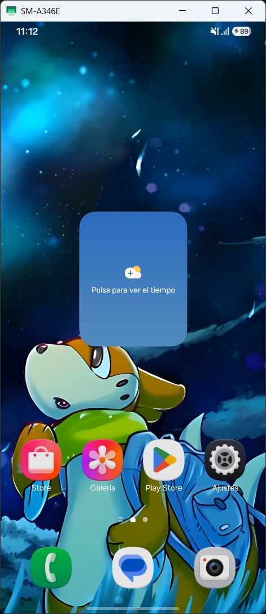
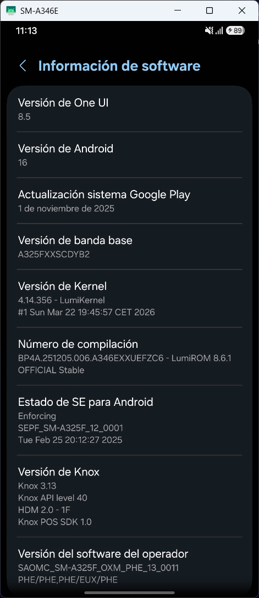
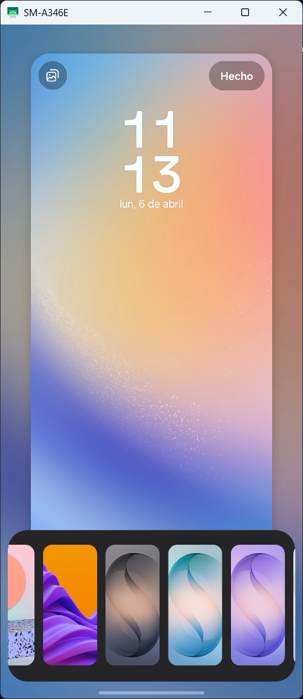

## What's changed on LumiROM 8.6.1?

- Fixed the apps that were crashing like X, Snapchat, others were significantly laggy like Telegram, should have been fixed too.
- Fixed the UI lag, should be smoother now
- Removed Samsung Messages and replaced with Google Messages, click here to know why -> [Link](https://t.me/techleakszone/9453).
- Added new wallpapers on the ROM, be sure to check them all going to wallpapers app, then select wallpaper and choose the default one, then tap below where it says "Other styles" to check the new walls!, there is some S26 walls aswell as one that I always use (I put it for default).
- Fixed VoLTE
- Added some stock props for get better perfomance on daily based tasks.
- Added A226B (Galaxy A22 5G) support as OFFICIAL builds.
- New A34 base: A346EXXUEFZC6 with 05-04-2026 security patch.
- New A24 base: A245FXXUBFZD1 with 05-04-2026 security patch.

### Screenshots

  

## Download

[Download LumiROM 8.6.1](https://t.me/LumiROMs)
