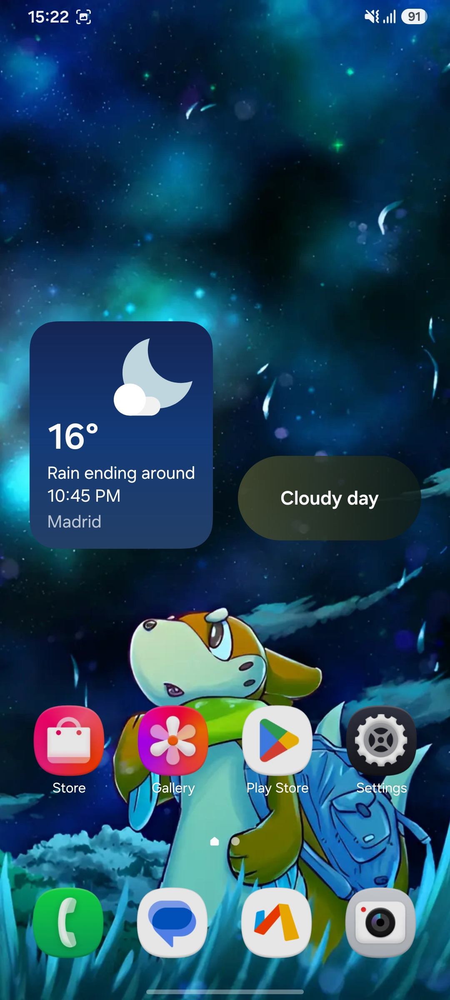
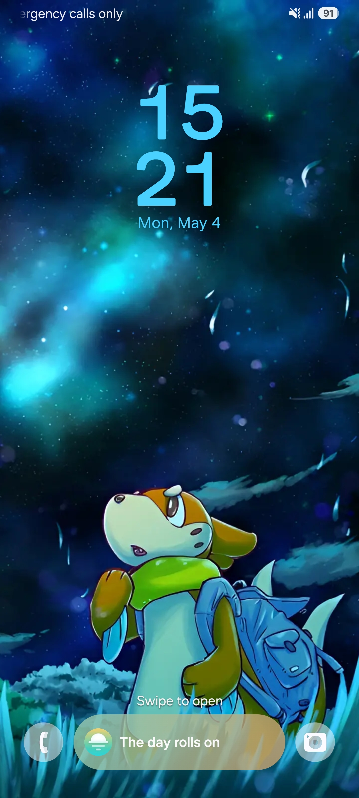
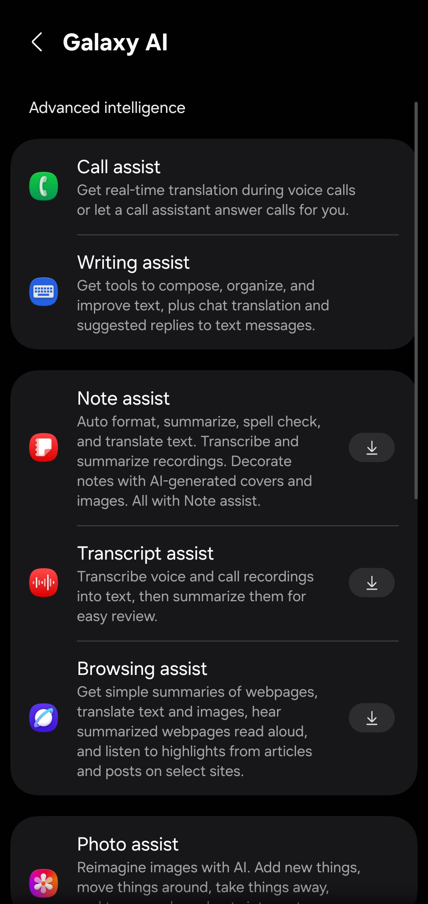
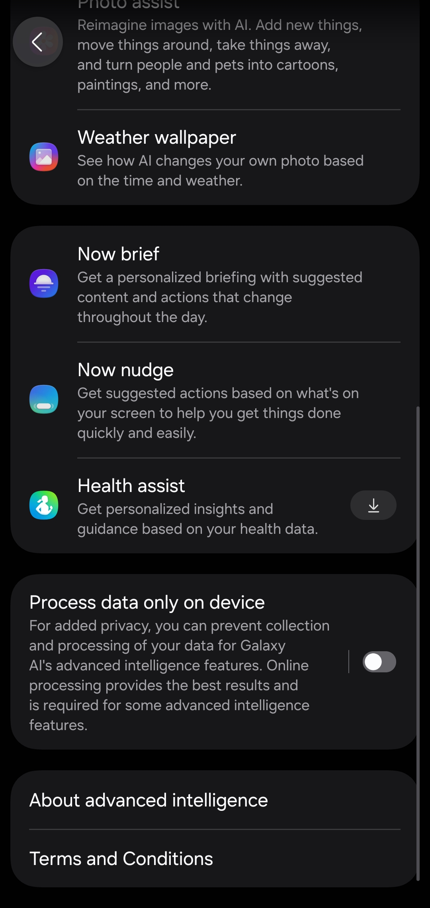

# What's changed on LumiROM 8.6.2?

## Fixes

## Features
- Added a ton of AI that hasn't been present in the rom until now, like Now Brief, Now nudge, Weather Wallpaper and more. Be sure to check them all out!

## Bugs
- You tell me.

## More
- Most of fixes has been added onto the script, I have been working hard to add more features and make the scripts a bit more stable and user-friendly.

# Screenshots

   

# Download
[Download LumiROM 8.6.2](https://t.me/LumiROMs)