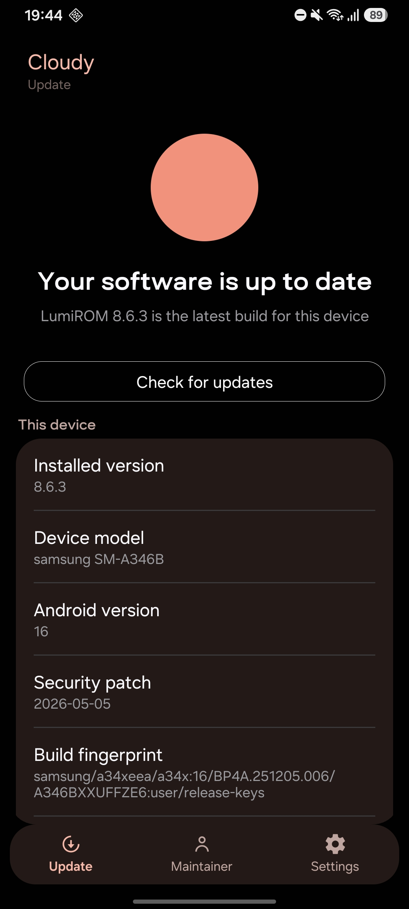
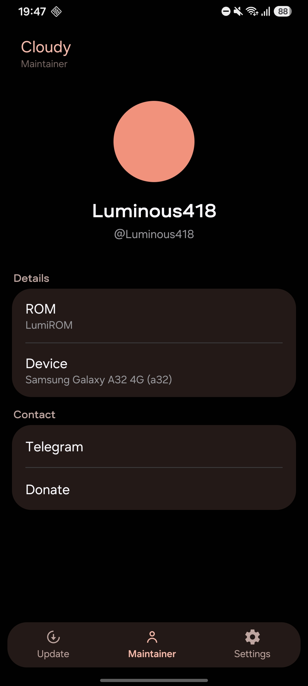

# What's changed on LumiROM 8.6.3?

## Fixes
- Attempt to fix hotspot

## Features
- Added an OTA Updater app for the rom called Cloudy, with this app you can stay updated with the rom and forget about complicated steps on flashing the ROM.

## Device Specific
- New A34 base: A346BXXSGFZG4 with 05-07-2026 (July) security patch.
- New A24 base: A245FXXSDFZG3 with 05-07-2026 (July) security patch.

# Screenshots

 

# Download
[Download LumiROM 8.6.3](https://t.me/LumiROMs)