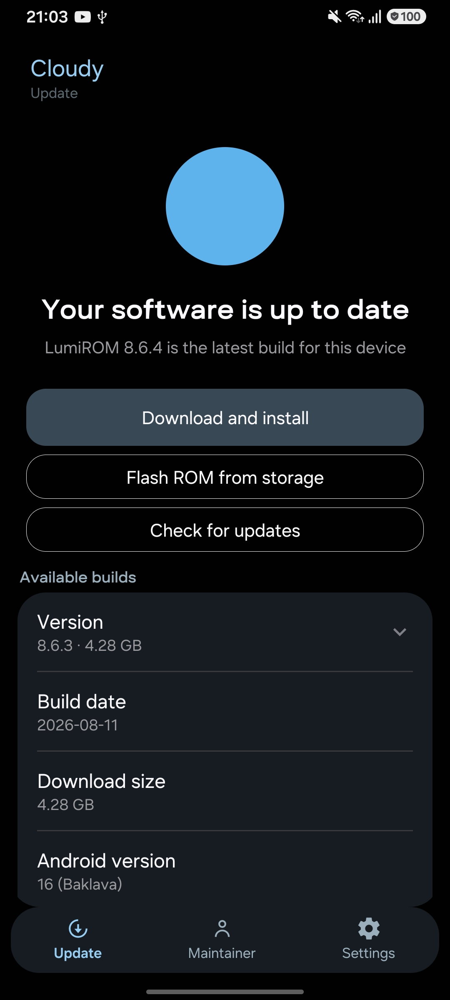
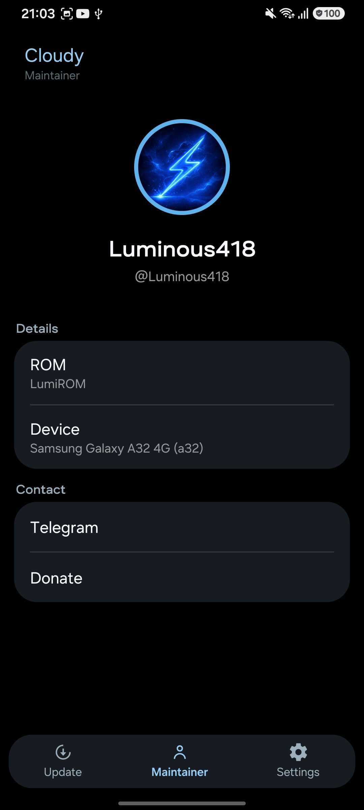

# What's changed on LumiROM 8.6.4?

## Fixes
- Now OTA app appears on homescreen

## Features
- Updated the OTA app, including support for the phones I support on the ROM.
- Also you can now install the ROM from a ZIP stored on the sdcard.

# Screenshots

 

# Download
[Download LumiROM 8.6.4](https://t.me/LumiROMs)